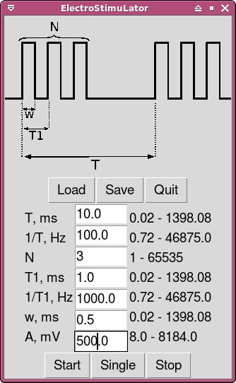

# Laboratory Electrostimulator Series: x-SLON
(transliterated Russian abbreviation).

Electrostimulator is essential equipment for any electrophysiological laboratory. Known commercial products are costly and are usually able to operate for strict procedures. Thus, the development of opensource solution is reasonable nowadays.

There is at least one solid opensource solution: PulsePal (https://sanworks.io/shop/products.php?productFamily=pulsepal). It is manufactured based on entirely different technology and allows a user to shape the signal manually with 0.1 us precision. Our solution serves only for producing unipolar rectangular voltage/current pulses. Operating software is lite and allows a user to generate pulse trains of a variable period, train length, pulse period and pulse width.

---

## Features

1. USB 1.1 interface

1. Single python module for GUI and scripting.

1. All models share the same API.

1. Power supply via USB.

1. U- and I- models provide the reference output. Stimulation output is galvanically isolated.

## Common characteristics

1. Time parameters:
    - Pulse width: 0.1 ms - 1000 ms
    - Pulse frequency: 1 - 10000 Hz
    - Number of pulses per train: up to  10000
    - Pulse train frequency: 1 - 10000 Hz
    - Rise time: < 1 us

1. Software-defined USB interface (USB 1.1 compliant)

1. Power supply: 5V via  USB

1. Temperature range: 0 – +40 С

## psi-SLON

It is the most compact stimulator with digital output. One can use psi-SLON to control devices with dedicated digital input.

### psi-SLON specifications

1. An amplitude of output impulses: +5V

1. Output resistance: 5 kOhm

1. Size: 45x25x10 mm

1. Output socket: DB-9F

1. Input socket: mini-USB

Research papers which make use of psi-SLON:

1. Borzykh, A. A., Kuz’min, I. V., Lysenko, E. A., Sharova, A. P., Tarasova, O. S., & Vinogradova, O. L. (2017). 
Measures of Growth Processes and Myogenesis in Glycolytic and Oxidative Muscle Fibers in Rats after Indirect Electrical Stimulation. Neuroscience and Behavioral Physiology, 47(3), 352-358.

1. Abramochkin, D., Tapilina, S., Vornanen, M. (2014) A new potassium ion current induced by stimulation of m2-cholinoreceptors 
in fish atrial myocytes. Journal of Experimental Biology, 217(Pt 10):1745–1751.

See [psi-slon project](https://github.com/kuzmin-ilya/u-slon) for details.

## U-SLON

U-SLON generates pulses of fixed voltage in a range 0-8 V. In a series all pulses have the same amplitude. The same GUI is used for stimulation control. 

### U-SLON specifications

1. Output voltage: 0-8 V

1. Output current: 0-200 mA

1. Defence from short-circuit.

1. Precision of output voltage: 10 bit

1. Size: 80x120x35

1. Output socket: Jack 6.5 mm

1. Input socket: USB-B

See [u-slon project](https://github.com/kuzmin-ilya/u-slon) for details.

## I-SLON

I-SLON generates pulses of fixed current in a range 0-100 mA with maximum voltage of 8 V. In a series all pulses have the same amplitude. The same GUI is used for stimulation control. 

This model is currently under development.

## Control software _guiSLON_

The main window of _guiSLON_ is shown in the Figure. The program has a simple interface and allows a user to set a pulse period, pulse width, number of pulses per train and train period.
The user can select between single pulse train and periodic pulse trains by pressing either the “Single” or the "Start" button.

See [esl project](https://github.com/pmamonov/esl) for details.

## Licensing

Different parts of x-SLON are released under different licenses and can
be regarded as separated projects. Circuits and packaging is released under
CC-BY AS and software - under GNU GPL. In fact one can use only hardware and
make own software or vice versa because these parts are rather independent.

See detailed licensing information in every project.

## Authors

Ilya Kuzmin <kuzmin.ilya@gmail.com>  
Peter Mamonov <pmamonov@gmail.com>  
Alexey Nesterenko <comcon1@protonmail.com>  
